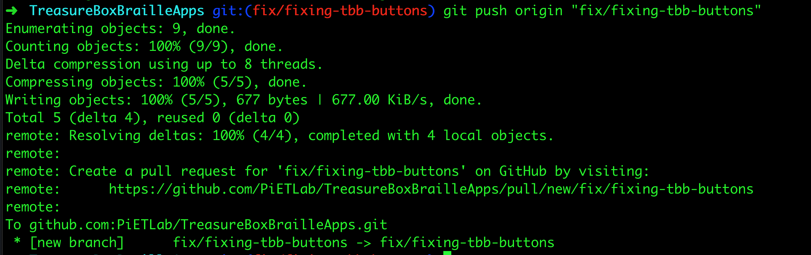
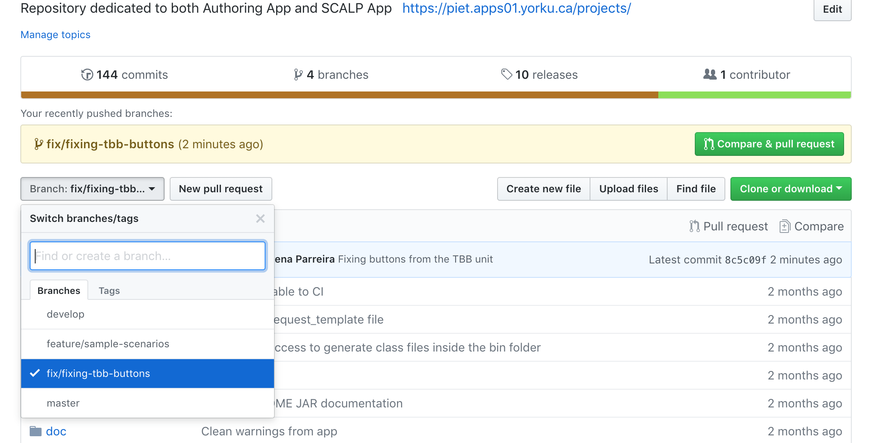
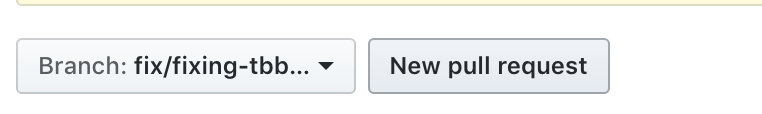
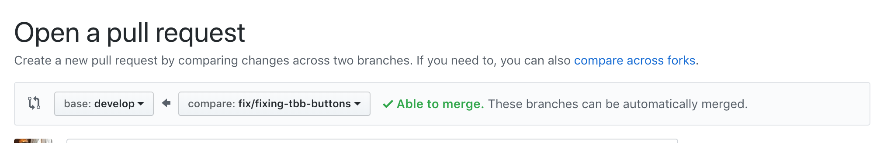
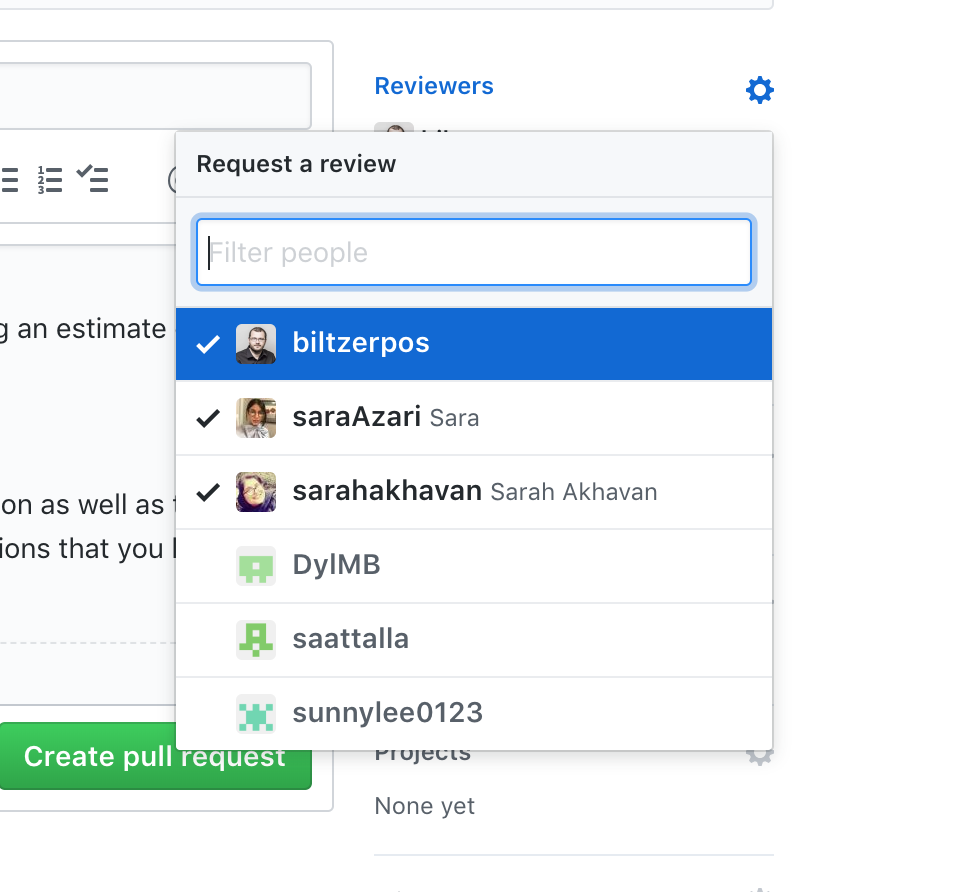
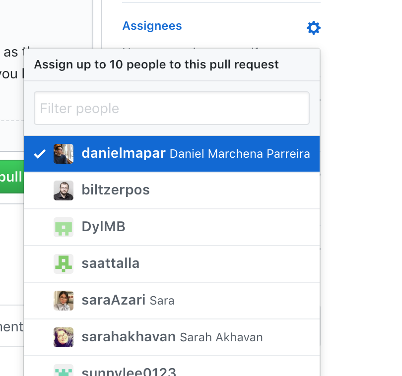
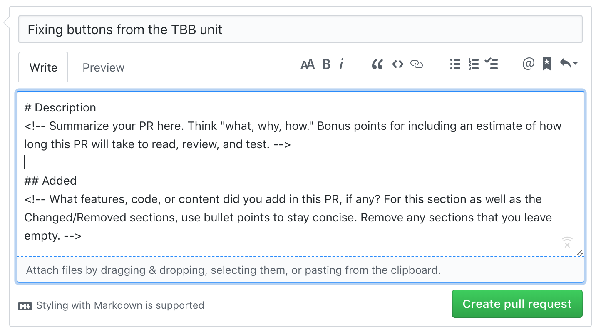
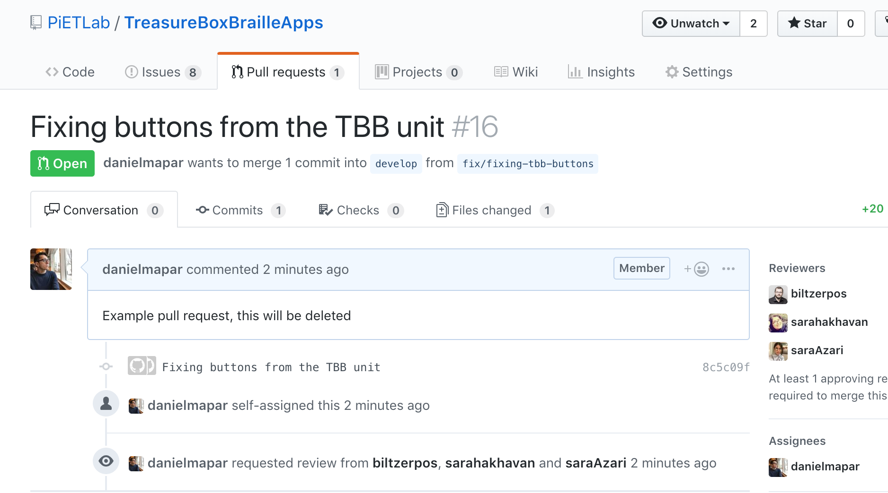

# How to create a pull request for TBB Apps / TBB Setup

*  First step is to clone the repository to your machine:
  * `git clone https://github.com/PiETLab/TreasureBoxBrailleApps`

* After that, navigate to the project directory: `cd TreasureBoxBrailleApps`

* Inside the project directory, checkout the `develop` branch and pull it:
  * `git checkout -b develop`
  * `git pull origin develop`

* Create a branch from `develop` for your specific purpose, to do that just run the following command:
  * `git checkout -b "fix/fixing-tbb-buttons"`
    * You will use `fix` for bug fixes and `feature` for new features
      * Example: `git checkout -b "feature/newbutton"`
      * Another example: `git checkout -b "fix/brokenbutton"`

* With the codebase in your machine and your local branch created, now it is time to apply any code changes needed.
  * In this example I will apply some changes to the `SCALP.java` file

* Whenever you are done with your code changes, commit those to your branch (in this case: `fix/fixing-tbb-buttons`). To do that run the following commands:
  * `git add --all`
  * `git commit -m "Fixing buttons from the TBB unit"`
  * `git push origin "fix/fixing-tbb-buttons"`
  * 

* Now your fix will be available at [Github](https://github.com/PiETLab/TreasureBoxBrailleApps/tree/fix/fixing-tbb-buttons) inside the `fix/fixing-tbb-buttons` branch.
  * 

* Finally, we will create a `pull request` based on your new branch. In order to do that, follow the screen shoots bellow
  * 
    * Select your branch from the dropdown (in our case: `fix/fixing-tbb-buttons`)
    * Click on `New pull request`

  * 
    * Base should always be `develop` and compare should be your branch `fix/fixing-tbb-buttons`
    * Check if you have any merge conflicts, it should show **Able to merge** on the right side

  * 
    * Assign people from the lab to review your pull request

  * 
    * Assign yourself as the `Assignee`

  * 
    * Follow the template and write a description

  * 
    * Click `Create pull request`

* Your are done!

 
